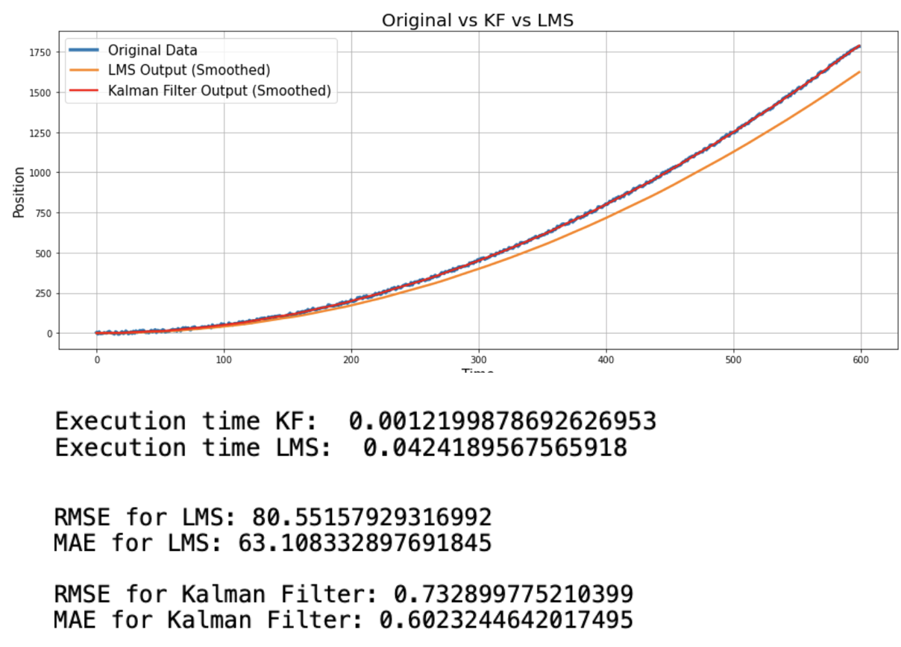

# Introduction

Given a raw data of a trajectory.  **Kalman Filter (KF)** was implemented on the data and prediction was avaluated.
Moreover,**Least Means Square (LMS)** algorithm was applied to the same data and **compare the outputs of KF and LMS**.

**Skills**:
- Python
- Algorithms: Kalman Filter, LMS

**Result** – Kalman Filter outperforms LMS.

